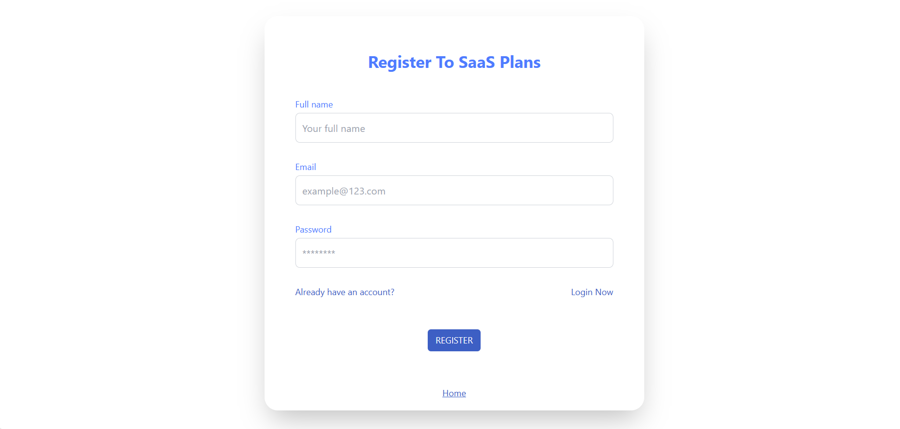
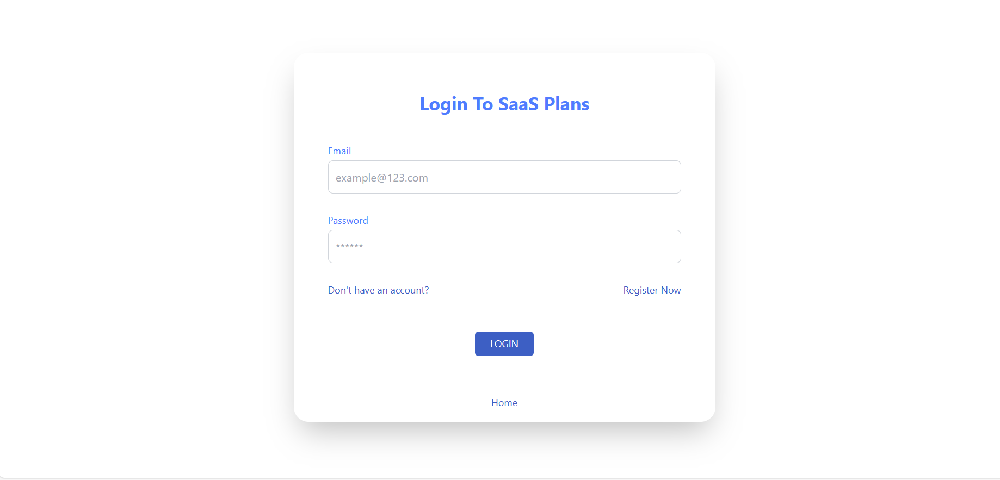
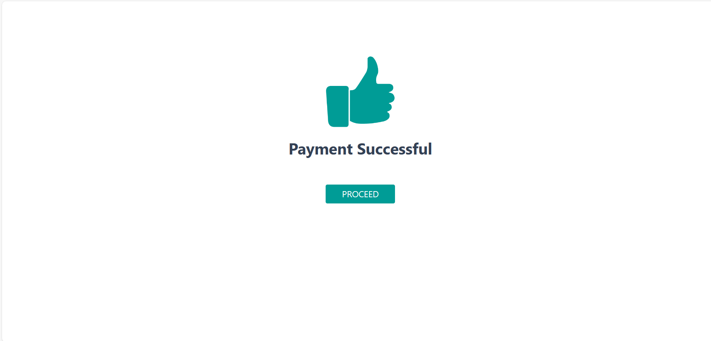
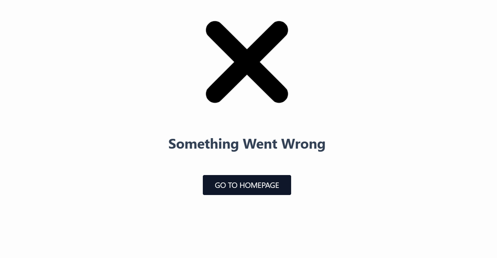

## Repository Setup

1. Install the required dependencies:

   ```
   $ npm install
   ```

2. Make sure the required fields are put as per .envsample file

3. Start the development server:

   ```
   $ npm run dev
   ```

4. Open your web browser and visit [http://127.0.0.1:5173/](http://127.0.0.1:5173/)

### Home Page:


### Register Page:


### Login Page:


### Success Page:


### Cancel Page:


